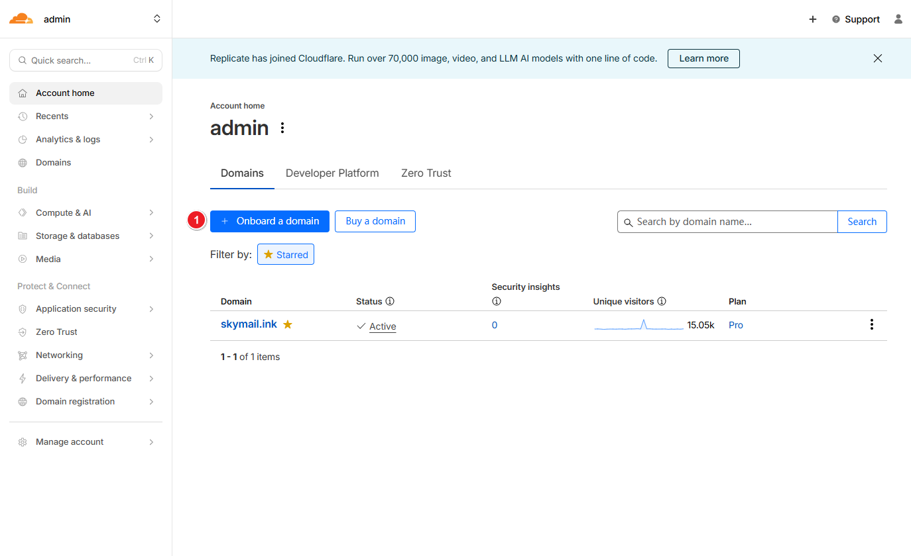

# Dashboard Deployment

## Account Preparation

Register a Cloudflare account at https://dash.cloudflare.com and add your domain.

## Create the Project

1. Fork or clone the repository to your own GitHub account: [https://github.com/maillab/cloud-mail](https://github.com/maillab/cloud-mail)

2. Create a new Worker project

3. Choose **Import from GitHub**

4. Set the directory to `mail-worker` and deploy the project

## Configure Environment Variables

| Variable Name | Required | Description                                                                               |
| ------------- | :------: | ----------------------------------------------------------------------------------------- |
| domain        |     ✅    | Email domain(s). Multiple domains are supported (e.g., `["example.com", "example2.com"]`) |
| admin         |     ✅    | Administrator email address (e.g., `admin@example.com`)                                   |
| jwt_secret    |     ✅    | JWT secret key. Use any random string; do not include special characters                  |

## Bind Databases

1. Create the KV and D1 databases

2. Add bindings. The variable names must be `kv` and `db`

## Configure Email Forwarding

## Log In to the Website

1. Open the following URL in your browser to initialize the database:

   `https://<your_worker_domain>/api/init/<your_jwt_secret>`

2. Open your worker domain in the browser, register the administrator account, and sign in to the website

