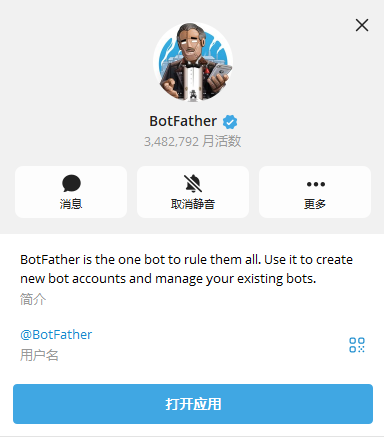
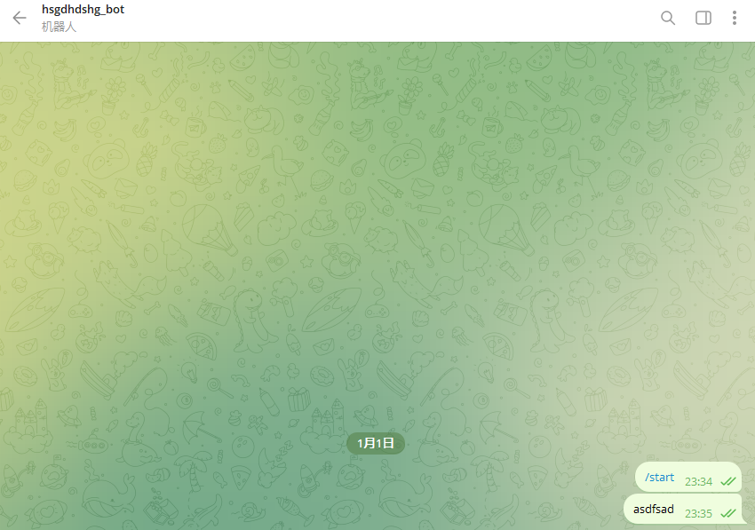
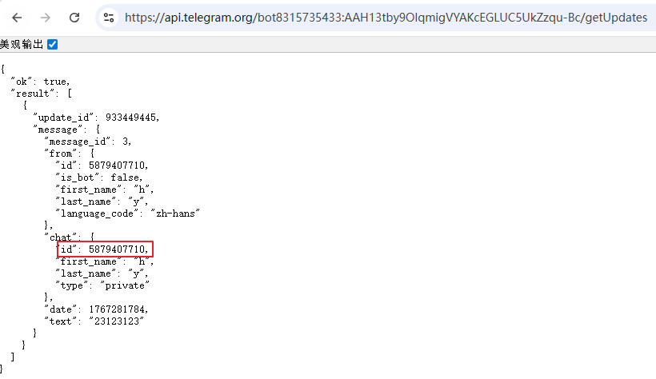
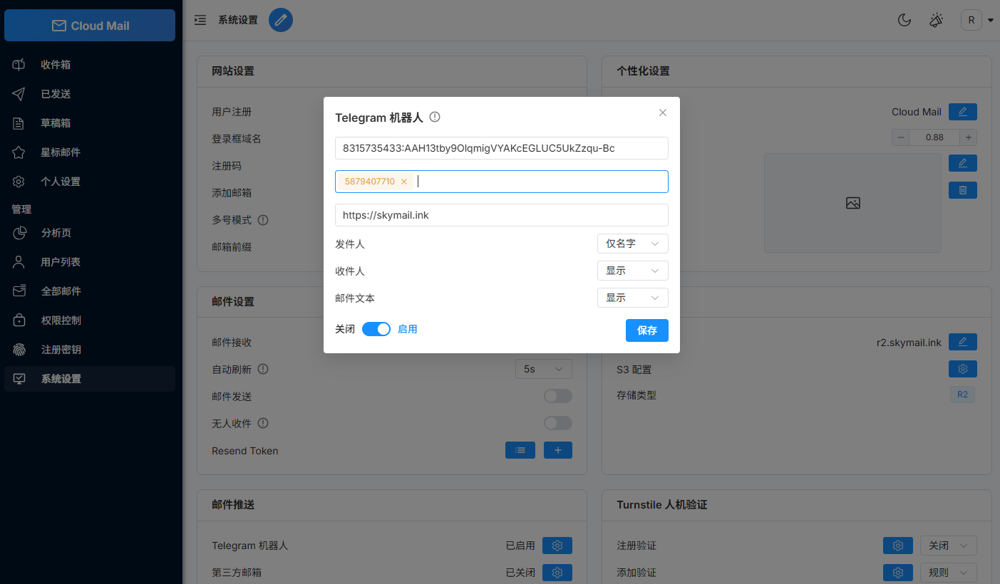
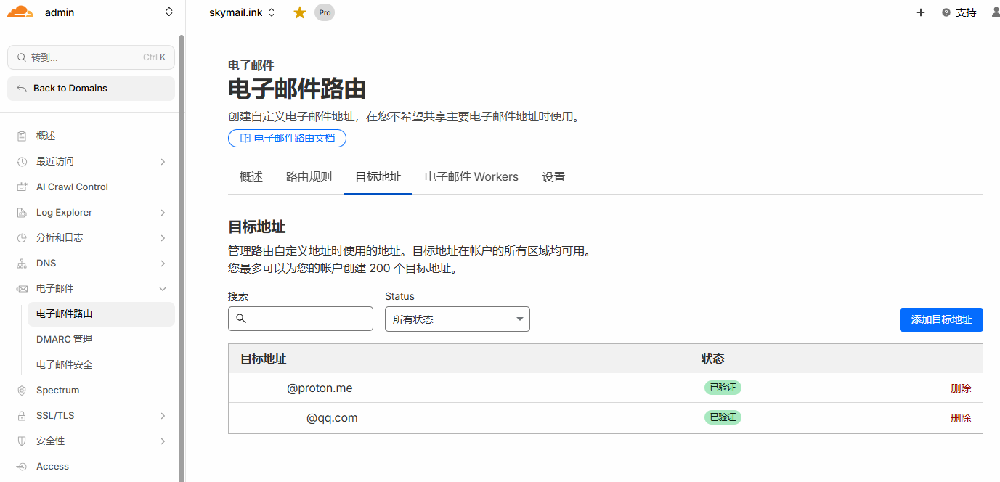
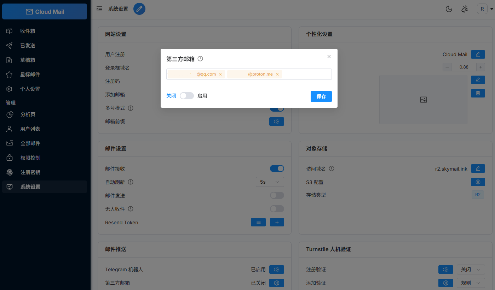

# Email Forwarding

## Forward to Telegram

1. Find this user on Telegram.

2.  Create a bot and copy the bot token.

3.  Send a message to the bot.

4. Open the following URL in a browser to obtain the chat_id:
   https://api.telegram.org/botYOUR_BOT_TOKEN/getUpdates
   If no result is returned, send a few more messages to the bot and try again.

5. Open System Settings and configure Telegram forwarding.

## Forward to Another Email Address

1. Complete email address verification in Cloudflare.

2. Open System Settings and configure email forwarding.
