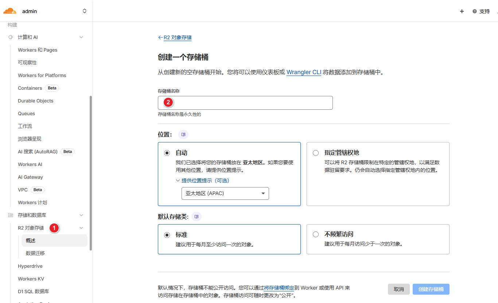
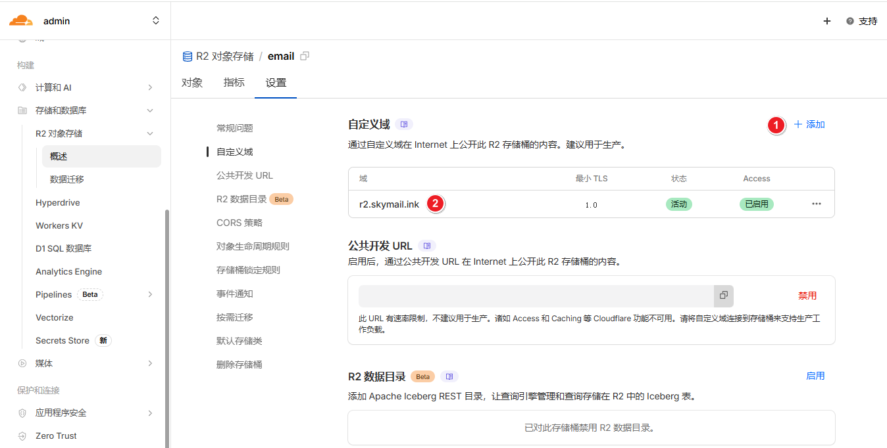
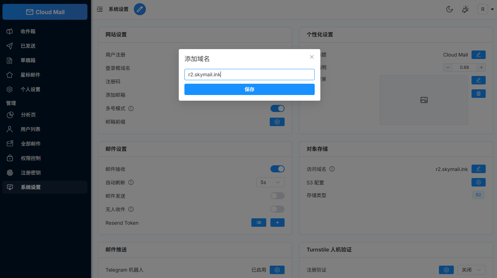

# Object Storage

:::warning
Email attachments are stored in KV by default.
Storage can be switched to R2 or any other S3-compatible service.
:::

1. Create an R2 storage bucket.

2. Configure a custom domain for the bucket.

3. Add the following value to GitHub Actions secrets and run the workflow.

| Secret Name  | Required | Description    |
| ---------- | :--: |-------|
| R2_BUCKET_NAME |  ✅  | R2 bucket name |
4. Open System Settings and configure object storage.
