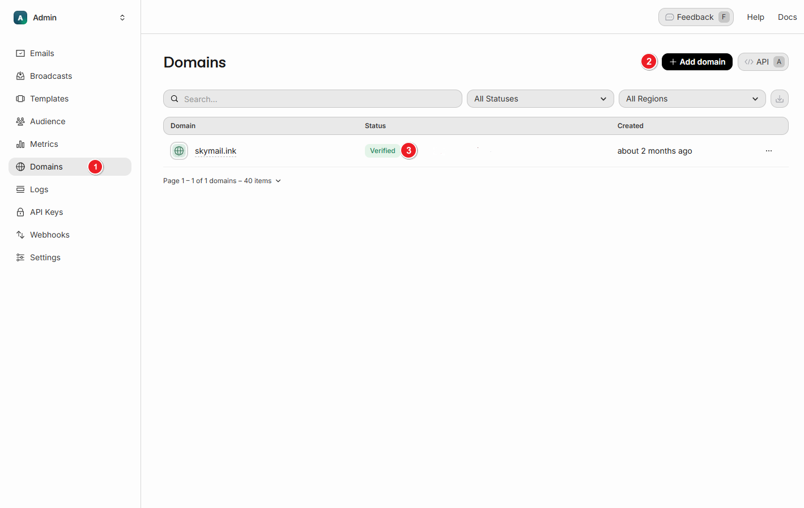
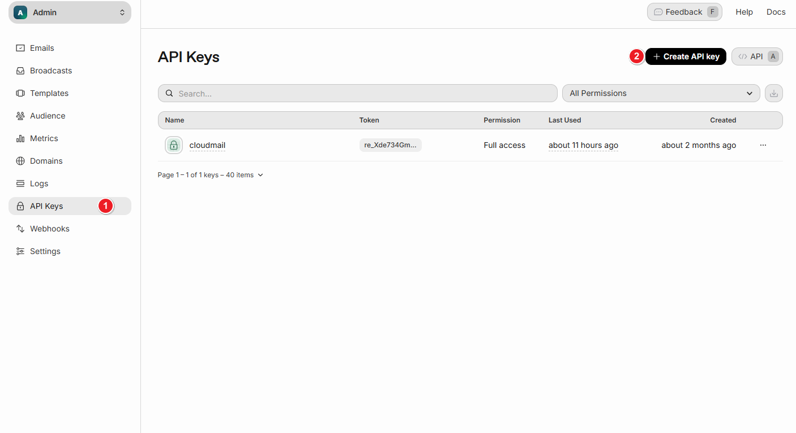
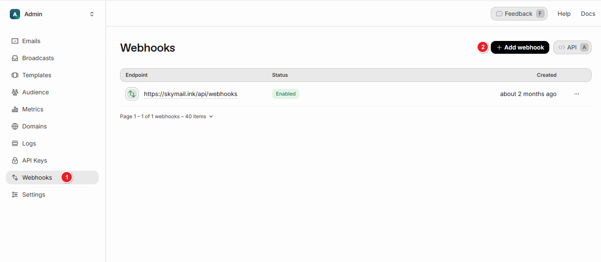
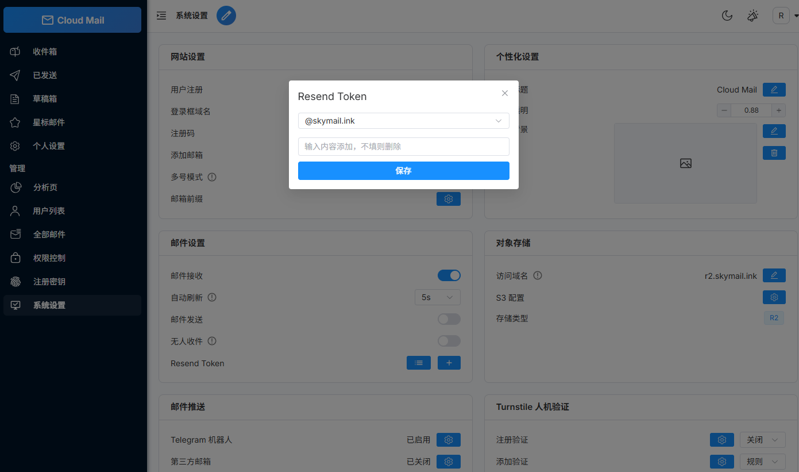

# Email Sending
:::warning
Cloudflare does not currently support sending emails.
Port 25 is blocked, so a third-party email service must be used.
:::

1. Register at https://resend.com
   , add your domain, and complete DNS verification.

2. Create an API key and copy it.

3. Add the status callback URL: `https://worker自定义域/api/webhooks`

4. Select the appropriate options.

5. Open System Settings and configure the email sending service.
