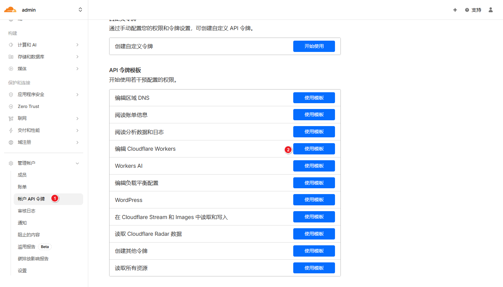
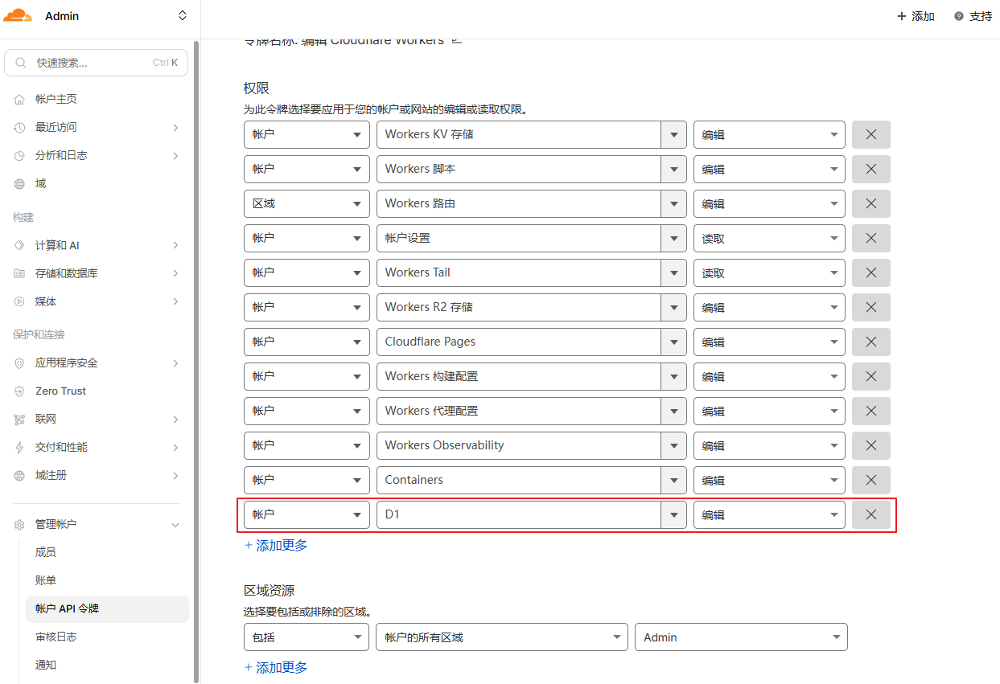
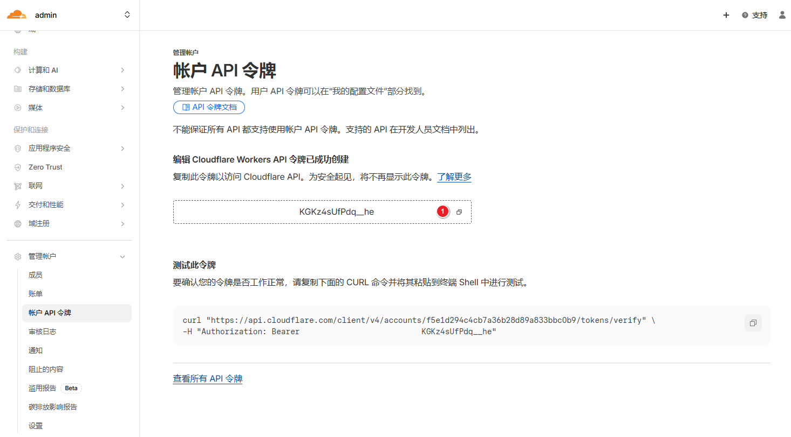
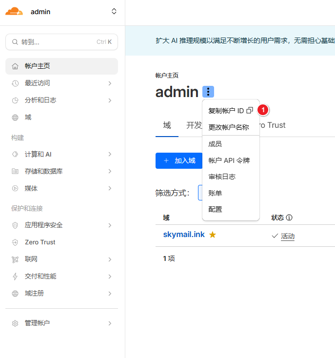
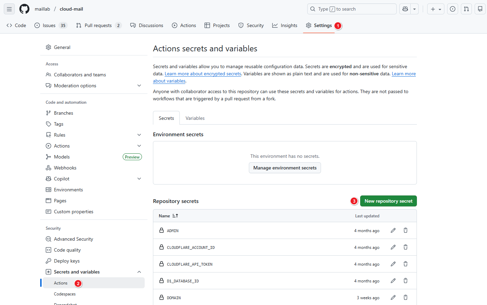
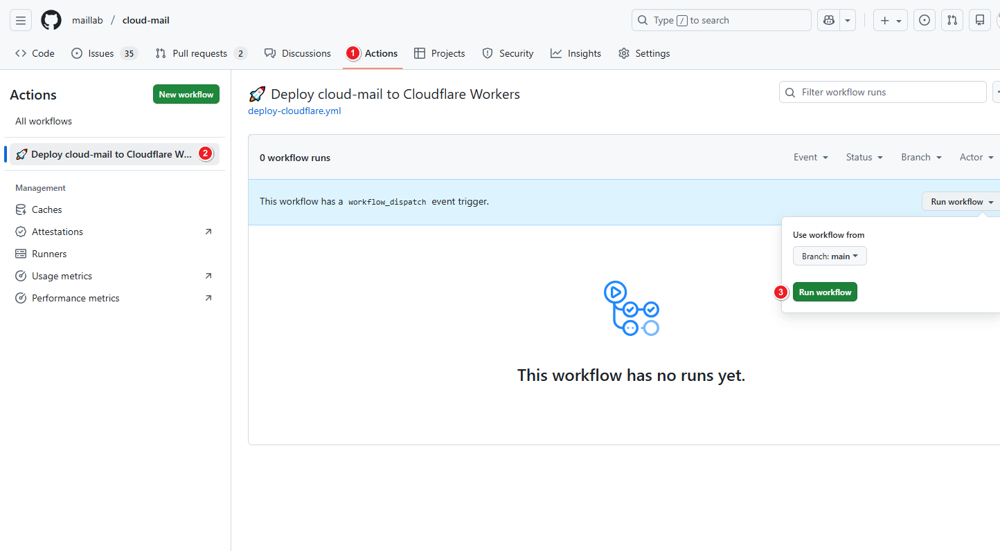
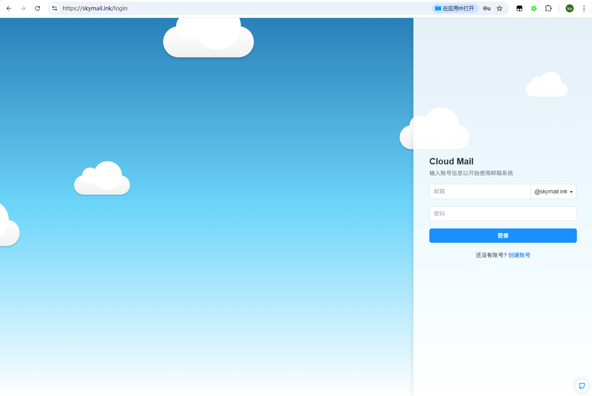

# Github Actions 部署

## 创建API令牌

1. [点击创建令牌](https://dash.cloudflare.com/profile/api-tokens)，选择模板

2. 添加对应权限

3. 复制API令牌

4. 复制账户ID

## 准备环境

1. Fork 克隆仓库 [https://github.com/maillab/cloud-mail](https://github.com/maillab/cloud-mail)

2. 配置 Action Secret 或 Variables 

 | 变量名                  | 必需 | 用途                                          |
|----------------------|:--:|---------------------------------------------|
 | CLOUDFLARE_API_TOKEN | ✅  | Cloudflare API 令牌                           |
 | CLOUDFLARE_ACCOUNT_ID | ✅  | Cloudflare 账户 ID                            | 
 | CUSTOM_DOMAIN        | ✅  | 自定义域名，用来访问网站的 （例如 `skymail.ink`）            |
 | DOMAIN               | ✅  | 邮箱域名,多域名用（例如 `["example.com","example2.com"]`） |
 | ADMIN                | ✅  | 管理员邮箱地址（例如 `admin@example.com`）             |
 | JWT_SECRET           | ✅  | JWT密钥 随便输入一串字符串，不要输入特殊字符                    |
 | NAME                 | ❌  | Worker项目名字，默认cloud-mail                     |
 | D1_DATABASE_ID       | ❌  | D1 数据库 ID ，默认使用Worker同名数据库                  |
 | KV_NAMESPACE_ID      | ❌  | KV 命名空间 ID，默认使用Worker同名数据库                  |

## 开始部署

1. 运行工作流

2. 等待运行完成

## 设置邮件转发
1. 参考界面部署  [设置转发](dashboard.html#设置转发) 步骤

2. 浏览器输入域名，注册管理员账号，登录网站

🎉**部署完成**🎉
