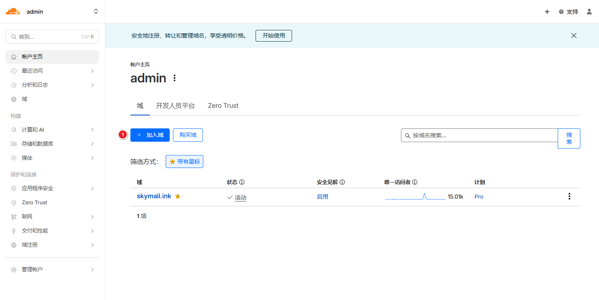
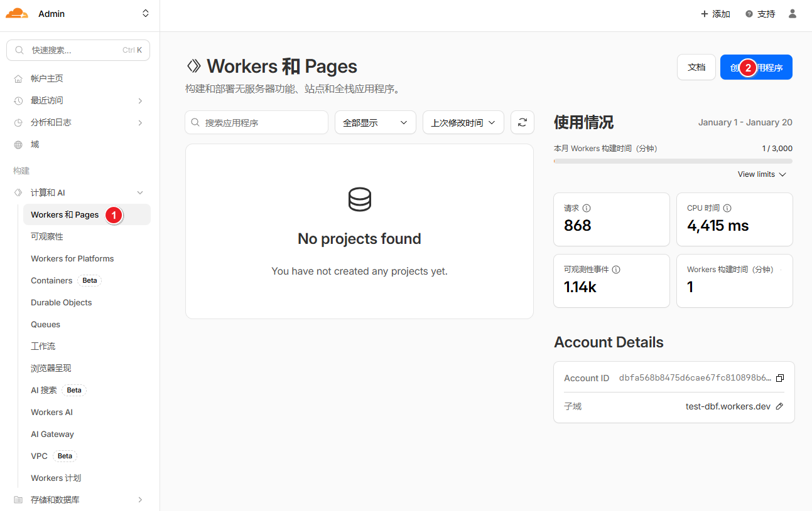
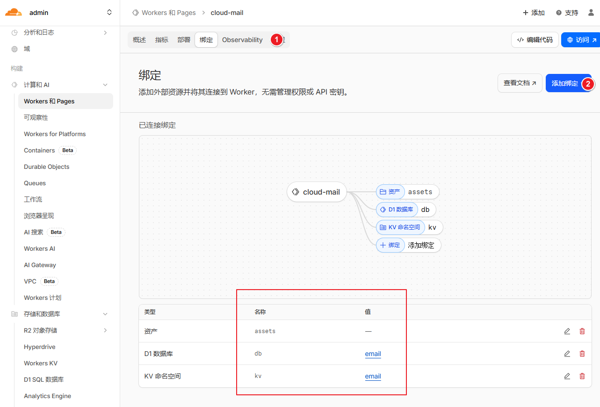
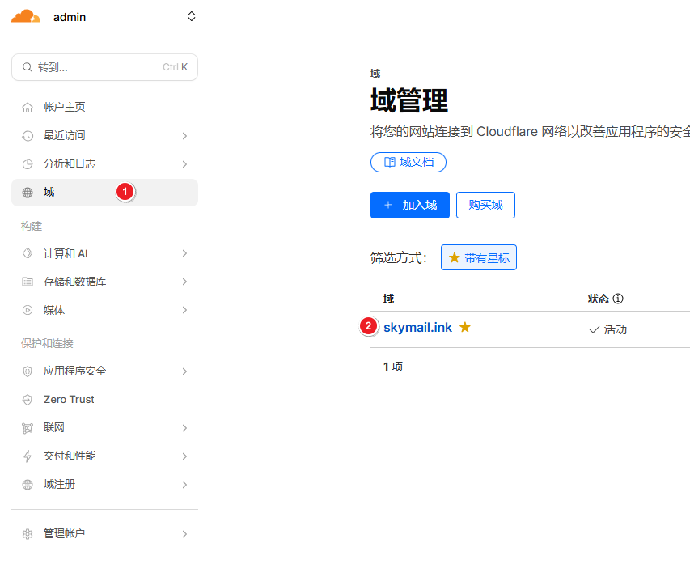
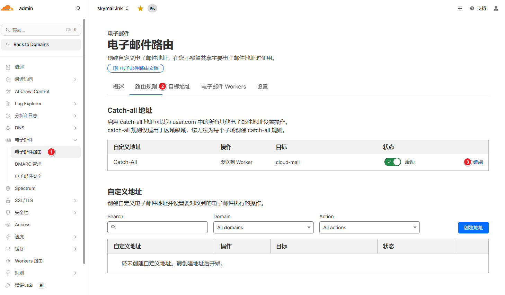
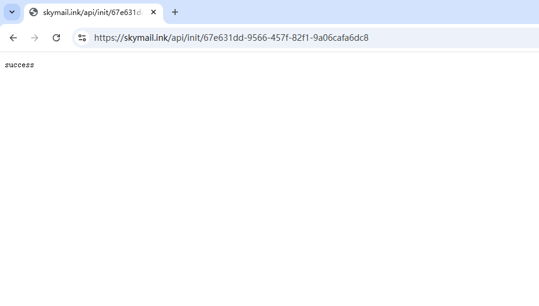

# 界面部署

## 准备账号

[注册Cloudflare](https://dash.cloudflare.com/)，并添加域名

不会的可以看这个教程：[域名接入Cloudflare](https://cloud.tencent.cn/developer/article/2518586?from=15425&policyId=undefined&traceId=&frompage=seopage)

## 创建项目
1. 克隆仓库到自己的GitHub账号 [https://github.com/maillab/cloud-mail](https://github.com/maillab/cloud-mail)

2. 创建worker项目

3. 选择GitHub导入

4. 设置目录 `mail-worker`，并部署

## 设置环境变量

| 变量名                   | 必需 | 用途                                             |
|-----------------------|:--:|------------------------------------------------|
| domain                | ✅  | 邮箱域名,多域名用（例如 `["example.com","example2.com"]`） |
| admin                 | ✅  | 管理员邮箱地址（例如 `admin@example.com`）                |
| jwt_secret            | ✅  | JWT密钥 随便输入一串字符串，不要输入特殊字符                       |

## 绑定数据库
1. 创建KV和D1数据库

2. 添加绑定，变量名必须为`kv`和`db`

## 设置转发

## 登录网站
1. 浏览器输入 `https://你的worker自定义域/api/init/你的jwt_secret` 初始化数据库

2. 浏览器输入自定义域名，注册管理员账号，登录网站
