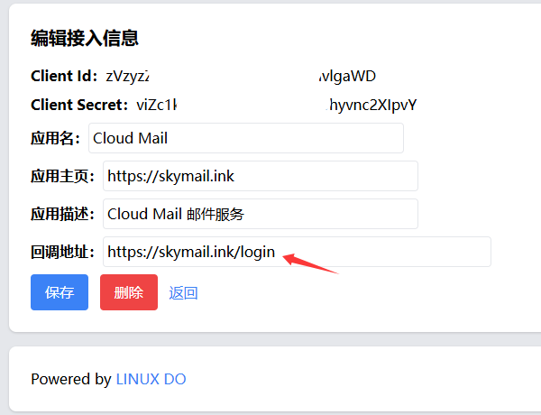

# 接入LinuxDo登录

## 设置回调地址

 在 https://connect.linux.do 接入应用，回调地址设置 `https//你的worker自定义域名/login`

## 设置环境变量

在项目 Worker 变量和机密 或 Github Actions 设置以下环境变量

| Worker Secret      | Action Secret  | 必需 | 用途                               |
|--------------------|----------------| :--: |----------------------------------|
| linuxdo_client_id  | LINUXDO_CLIENT_ID |  ✅  | Client Id                        |
| linuxdo_client_secret | LINUXDO_CLIENT_SECRET |  ✅  | Client Secret                    |
| linuxdo_callback_url | LINUXDO_CALLBACK_URL |  ✅  | 回调地址  `https//你的worker自定义域名/login` |
| linuxdo_switch     | LINUXDO_SWITCH |  ✅  | true 或 false  用于开启或关闭登录          |
