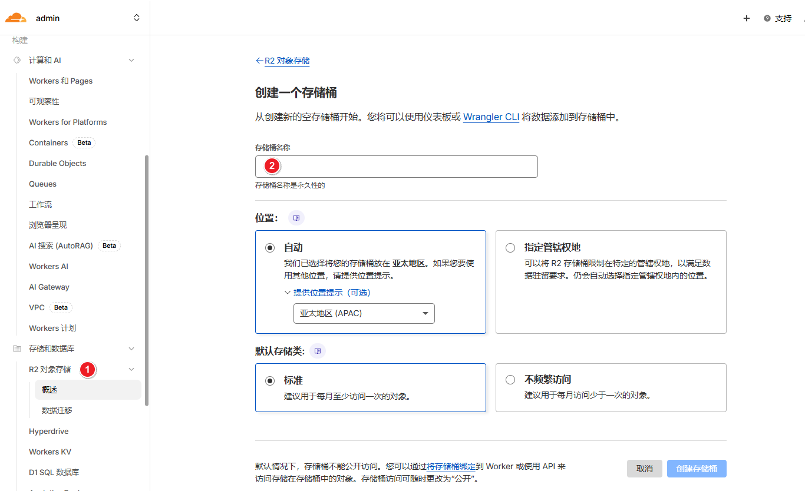
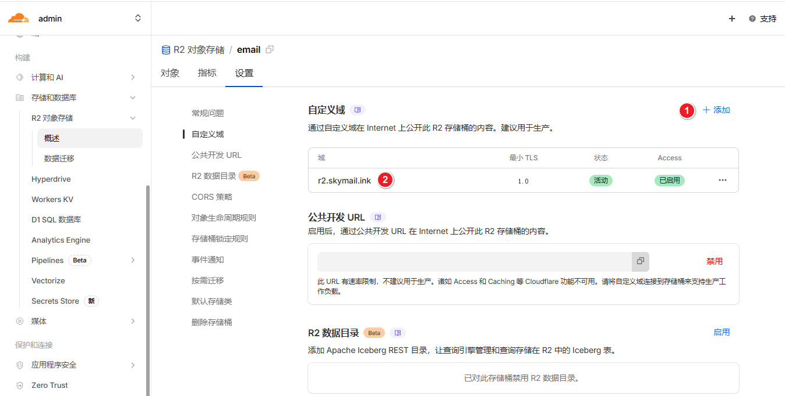
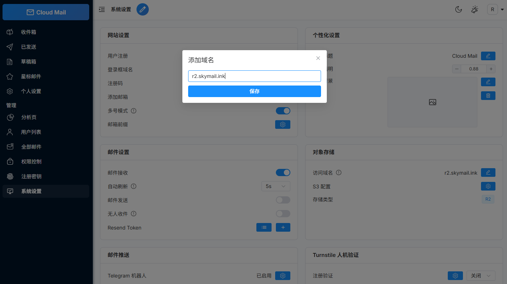

# 对象存储

:::warning
邮件附件默认使用KV存储，可以切改为R2或其他S3协议存储
:::

1. 创建R2对象存储桶

2. 设置自定义域名

3. 添加到Action Secret 或 Worker 绑定

| Worker 绑定名称 | Action Secret  | 必需 | 用途    |
|-------------|---------------------| :--: |-------|
| r2          | R2_BUCKET_NAME      |  ✅  | R2桶名称 |

4. 系统设置
